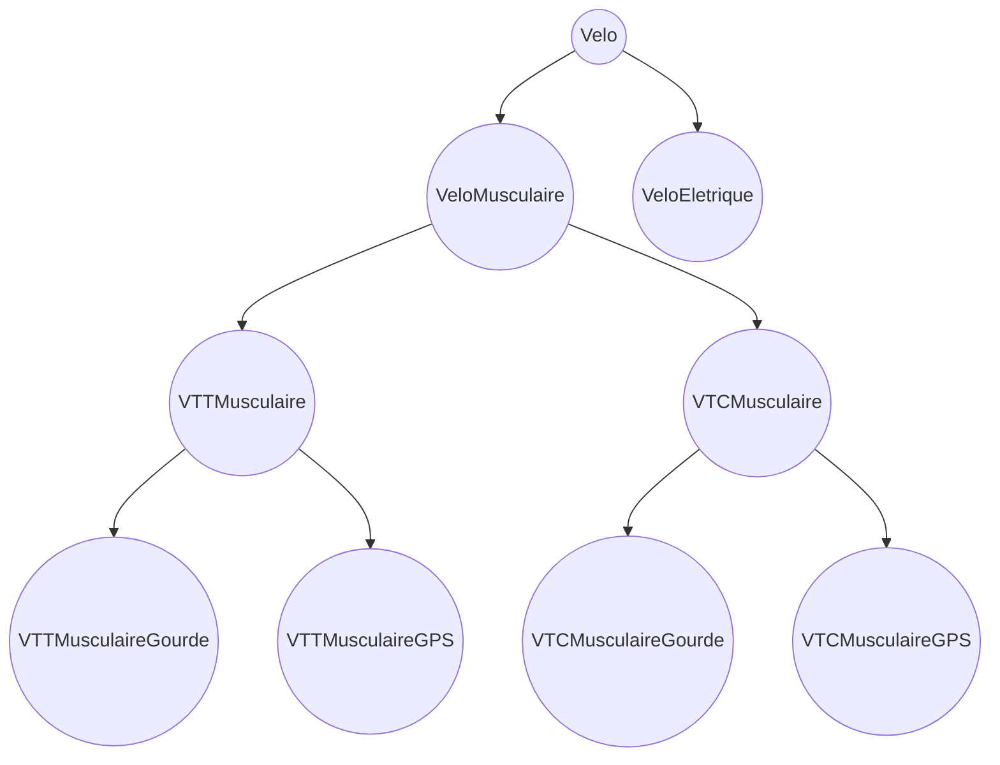

Dans notre exemple de pattern Builder, nous avions un grand nombre d'options et toutes devaient être renseignées.
Dans d'autres situations nous pourrions souhaiter ajouter/supprimer ces options à une classe. Cela peut notamment être utile lorsque le code à embarquer pour chaque option est trop lourd et que nous souhaitons conserver des objets légers avec le code minimum nécessaire en accord avec les options sélectionnées.

Une première approche pourrait être de concevoir une hiérarchie comem celle-ci :



Mais cela pose rapidement problèmes :
- la multiplicité des options va impliquer un très grand nombre de classes
- il ne sera pas possible de combiner les options (héritage multiple)

Nous aimerions donc pouvoir rédiger quelque chose comme 
```java
Velo = new Velo();
velo = ajouteBatterie(velo); //devient un VeloElectrique
velo = ajoutePneuTT(velo); //devient un VttElectrique
velo = ajouteGourde(velo); //devient un VttEletriqueAvecGourde
```

Plusieurs problèmes : 
- on ne pourra créer autant de classes que de combinaisons d'options. On va donc s'arrêter au distingo VeloElectrique/VeloMusculaire
- l'ajout d'une option doit pouvoir ajouter des logiques spécifiques à notre objet. Ce qui implique forcément l'instanciation d'une nouvelle classe

On doit donc avoir une syntaxe du type :
```java
Velo velo = new VeloEletrique(velo);
velo = new DecoratorVtt(velo); //devient un VttElectrique de type VTT
velo = new DecoratorGourde(velo); //devient un VeloElectrique de type VTT, avec Gourde
```

Les classes `DecoratorVtt` et `DecoratorGourde` sont donc des classes filles (directes ou indirectes) de la classe Velo.

On peut également écrire le code précédent comem suivant :
```java
Velo velo = new DecoratorGourde(new DecoratorVtt(new VeloEletrique(velo)));
```

# Mission 1
Sur la base de ce code :
```java
Velo velo1 = new VeloElectrique(velo);  
Velo velo2 = new DecoratorVtt(new VeloElectrique(velo));  
Velo velo3 = new DecoratorGourde(new DecoratorVtt(new VeloElectrique(velo)));  
Velo velo4 = new DecoratorGourde(new VeloElectrique(velo));  
  
System.out.println(velo1.getLabel()); //Doit retourner "Vélo électrique"  
System.out.println(velo2.getLabel()); //Doit retourner "Vélo électrique [VTT]"  
System.out.println(velo3.getLabel()); //Doit retourner "Vélo électrique [VTT] [Gourde]"  
System.out.println(velo4.getLabel()); //Doit retourner "Vélo électrique [Gourde]"  
  
System.out.println(velo1.getPrice()); //Doit retourner 100  
System.out.println(velo2.getPrice()); //Doit retourner 150  
System.out.println(velo3.getPrice()); //Doit retourner 170  
System.out.println(velo4.getPrice()); //Doit retourner 120
```

Rédigez l'implémentation de `DecoratorVtt` ,`DecoratorGourde` et éventuelles autres classes / interfaces nécessaires.

Précision pour le prix :
- un vélo électrique doit coûter 100€
- la configuration VTT doit ajouter 50€
- l'ajout d'une groude doit coûter 20€

# Notes

Le plus souvent, il est souhaitable de démarquer clairement quelles sont les classes de type Decorator de celles qui définissent notre hérarchie (Velo/VeloElectrique/VeloMusculaire). La solution consiste à créer une classe VeloDecorator qui hérite de Velo. Les Decorator hériteront à leur tour de VeloDecorator.
VeloDecorator n'ayant pas vocation à être instanciée, elle sera déclarée abstraite.

# Autre exemple

Prenons la situation suivante : un framework web me permet de persister en base de données une liste d'objets grâce à une classe `Processor`.

Je peux ainsi écrire :

```java
public void handleRequest(Processor defaultProcessor, List<Velo> velos) {
	defaultProcessor.process(p)
}
```

Mon framework me procure un `defaultProcessor` qui effectue le travail nécessaire à la sauvegarde en BDD.
Je peuxc redéfinir le `defaultProcessor` depuis la configuration suivante :

```java
public Processor configureDefaultProcessor(
	return new ProcessorDefault();
}
```

Je souhaite également déclencher des logs de ces opérations, mais uniquement si je suis en développement.
En production je souhaite que toute erreur déclenche un envoi de mail.
Le framework me procure des décorateurs à ces fins :

```java
public Processor configureDefaultProcessor(
	if(MODE == 'DEV) {
		return new ProcessorDecorateLog(new ProcessorDefault());
	}
	return new ProcessorDecorateMailIfError(new ProcessorDefault(), "admin@domain.tld");
}
```

Je peux également chaîner les 2 décorateurs, et dans ce cas l'ordre définira l'exécution

```java
public Processor configureDefaultProcessor(
	return new ProcessorDecorateMailIfError(new ProcessorDecorateLog(new ProcessorDefault()), "admin@domain.tld");
}
```